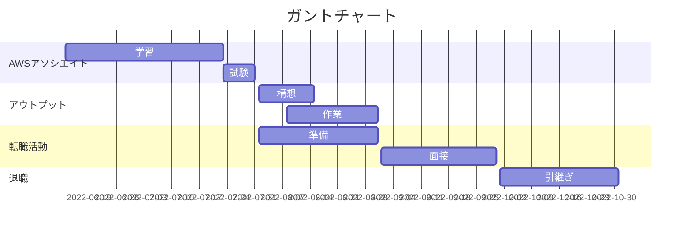

# Today-I-Learned
毎日の学習やアウトプットを行うためのリポジトリです。  
記録を付けモチベーションの維持と目標を達成するための行動を可視化させる。

## スケジュール

```mermaid
gantt
    title ガントチャート
    dateFormat YYYY-MM-DD
    %% (`excludes` accepts specific dates in YYYY-MM-DD format, days of the week ("sunday") or "weekends", but not the word "weekdays".)

    section AWSアソシエイト
    学習 :stydy, 2022-06-13, 2022-07-23
    試験 :test, after stydy, 2022-07-31

    section アウトプット
    構想 :2022-08-01, 2022-08-15
    作業 :2022-08-08, 2022-08-31

    section 転職活動
    準備 :2022-08-01, 2022-08-31
    面接 :2022-09-01, 2022-09-30

    section 退職
    引継ぎ :2022-10-01, 2022-10-31
```
